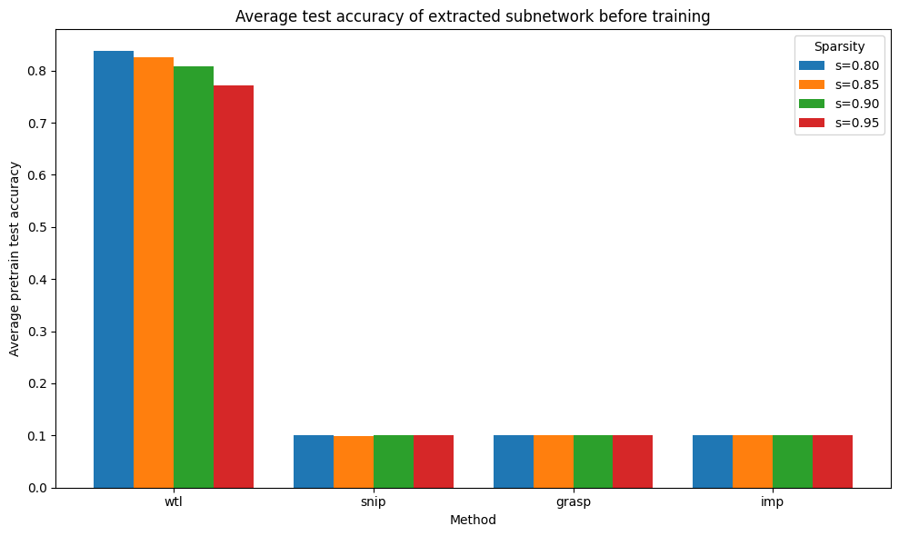

# JACKPOT!

Research code for **reliably extracting strong lottery ticket (high performing) subnetworks from UNTRAINED neural networks**, and comparing that to classic pruning-at-initialization baselines.



## Abstract
The lottery ticket hypothesis proposes that large random neural networks contain sparse subnetworks that can match the performance of the original dense model. Later work established a strong version of this phenomenon: sufficiently overparameterized random networks contain subnetworks that already approximate a target network before any weight training. What remains difficult in practice is not existence, but extraction. 

This note reorganizes that problem around a single bottleneck in *edge-popup* style methods: the need to choose layer-wise sparsity levels. We show that if a layer is at least half sparse, then fixing the mask density at one half does not reduce the set of subnetworks that can be represented, and we extend this observation to a doubled score space that preserves the same representational freedom for dense layers without explicitly doubling the weight matrices. 

This yields an algorithm,  which that we call *double-scoring* and is only mildly different from Ramanujan et al's *edge-popup* algorithm, yet is capable of extracting strong lottery tickets from neural networks and has the same asymptotic runtime as classical training.  We then perform a number of experiments, showing that *double-scoring* outperforms all other existing lottery ticket extraction methods and that the obtained strong tickets are also weak lottery tickets.  Finally, we conclude with a number of experiments of a more speculative nature and will attempt to convince the reader that this new lottery ticket extraction capability allows for a host of completely novel and highly desirable possibilities.

## What’s here

| Area | Role |
|------|------|
| `src/Jackpot/pruning/popup.py` | **Edge-popup** style trainable scores; binary masks via a straight-through estimator. |
| `src/Jackpot/pruning/snip.py`, `grasp.py` | **SNIP** / **GraSP**: one-shot masks from gradients / Hessian–gradient products on a mini-batch. |
| `src/Jackpot/pruning/imp.py` | **Iterative magnitude pruning** on a masked copy of the network (trained baseline). |
| `src/Jackpot/models/` | CIFAR-friendly **VGG-16** and **MLP**, plus `MaskLayer` / `MaskedNetwork` for explicit binary masks. |
| `src/Jackpot/training/` | Data loaders, training loop, and eval helpers. |

## Setup

```bash
python -m venv .venv && source .venv/bin/activate
pip install -r requirements.txt
```

Run scripts from the repo root with `PYTHONPATH` including `src`:

```bash
PYTHONPATH=src python scripts/run_dbl_popup.py
```
